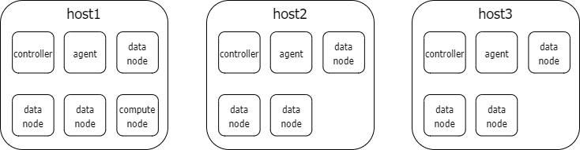

## 使用 Ansible 自动化部署 DolphinDB 集群
- [使用 Ansible 自动化部署 DolphinDB 集群](#使用-ansible-自动化部署-dolphindb-集群)
- [1.介绍](#1介绍)
- [2.前置条件](#2前置条件)
- [3. 在 Linux 主机上部署一个普通集群](#3-在-linux-主机上部署一个普通集群)
  - [3.1 定义各个进程（节点）的 IP 和节点名称的对应关系](#31-定义各个进程节点的-ip-和节点名称的对应关系)
  - [3.2 配置各个进程（节点）的监听端口](#32-配置各个进程节点的监听端口)
  - [3.3 配置硬盘目录](#33-配置硬盘目录)
  - [3.4 配置本机的 DolphinDB 二进制文件路径](#34-配置本机的-dolphindb-二进制文件路径)
  - [3.5 设置 raft\_controller 为 False](#35-设置-raft_controller-为-false)
  - [3.6 启动](#36-启动)
- [4. 在 Linux 主机上部署一个 Raft 高可用多控制节点的 DolphinDB 集群](#4-在-linux-主机上部署一个-raft-高可用多控制节点的-dolphindb-集群)

## 1.介绍

在部署 DolphinDB 集群时，用户通常需要对多个文件进行配置，例如在多个不同文件中的多处配置同一个IP。为了提升效率，我们可以使用 Ansible 工具实现 DolphinDB 集群的自动化部署。本文为大家介绍了如何使用 Ansible 自动化部署 DolphinDB 集群，尽量做到同一值在配置文件中只出现一次，从而简化部署过程。

## 2.前置条件

* 在主控机器上克隆或下载本项目，然后通过 `cd` 指令进入到下载目录。
* 阅读用户手册：通过 [分布式数据库](https://www.dolphindb.cn/cn/help/DatabaseandDistributedComputing/Database/DistributedDatabase.html) 来了解 DolphinDB 集群控制节点（controller）、代理节点（agent）、计算节点和数据节点的相关定义，以及 DolhinDB 集群如何通过使用 Raft 机制来实现控制节点的高可用，详见 [集群配置](https://www.dolphindb.cn/cn/help/DatabaseandDistributedComputing/Configuration/ClusterMode.html)。
    
* 本地安装 Ansible，参考：[教程](https://docs.ansible.com/ansible/latest/installation_guide/intro_installation.html)。本文使用的 ansible-playbook 版本为 2.9.X。
* 运行如下命令，安装社区扩展：
  ```
  ansible-galaxy collection install community.general
  ```
* 一个或多个有 SSH 权限的 Linux 远程机器。如果集群的控制节点开启了元数据高可用机制，则至少需要三台机器。
* （可选）如果远程机器上不能进行 SSH 公钥认证或尚未配置，可通过以下指令在本地机器上安装 sshpass：

    ```
    sudo apt-get install sshpass ##for Ubuntu
    ```

* 准备好磁盘卷。建议将控制节点的元数据、数据节点的 Redolog 和 chunkMetaData 存储在 SSD 磁盘上，而数据节点的实际数据可以存储在 HDD 磁盘上，详见 [数据模型](https://www.dolphindb.cn/cn/help/DatabaseandDistributedComputing/Database/DataModel.html)。更多内容，参考第二节对 `controller_home_dir`, `datanode_volume_prefix`, `datanode_redolog_prefix` 等变量的描述。
* 确保 SSH 用户对要使用的磁盘卷拥有读写的权限。
* 通过 [官网](https://www.dolphindb.cn/) 下载社区版 DolphinDB Server（包含试用版本的许可证）至本机。也可以申请商业版本的许可证。

## 3. 在 Linux 主机上部署一个普通集群

Ansible 的运行机制是提供声明式的语法，将要执行的操作和可变的配置项分隔开。最常见的用法是:

`ansible-playbook -i some.ini some.yml`

其中, .yml 文件包含了执行操作的逻辑，而 .ini 包含了可变的配置项。在本教程所用仓库中，yml 文件，即 deploy.yml （已经写好），提供了一个较为通用的用于部署 DolphinDB 集群的执行逻辑，无需修改。用户只需要定义或修改 [inventory.ini](inventory.ini)。编写好之后，用户无需关心 DolphinDB 的各种配置文件，如 cluster.cfg 和 cluster.nodes。

下面这个例子将近一步说明 inventory.ini 应该如何编写和修改：

假设使用两台服务器部署一个集群，包含一个控制节点（在 192.168.1.1），两个数据节点（分别在 192.168.1.1 和 192.168.1.2），以及两个代理节点（也分别在 192.168.1.1 和 192.168.1.2）。

### 3.1 定义各个进程（节点）的 IP 和节点名称的对应关系

首先我们在 inventory.ini 中定义如下内容：

```
[controllers]
controller1 ansible_host=192.168.1.1
[agents]
agent1  ansible_host=192.198.1.1
agent2  ansible_host=192.198.1.2
[datanodes]
data1 ansible_host=192.198.1.1
data2 ansible_host=192.198.1.2
```

其中 `controller1`, `agent1`, `agent2`, `data1`, `data2`，被用作集群中 DolphinDB 进程的别名.建议用户设置该变量时，确保命名唯一，有意义且仅包含英文字母和数字。

### 3.2 配置各个进程（节点）的监听端口

由于 DolphinDB 各个节点（即进程）需要网络通信，我们需要定义各进程监听的端口，即变量 port。在每行最后追加：

```
[controllers]
controller1 ansible_host=192.168.1.1 port=10010
[agents]
agent1  ansible_host=192.198.1.1 port=10011
agent2  ansible_host=192.198.1.2 port=10011
[datanodes]
data1 ansible_host=192.198.1.1 port=10012
data2 ansible_host=192.198.1.2 port=10012
```

注意同一个服务器上的各个进程的监听的端口不能相互冲突，也不能和已有进程冲突。

### 3.3 配置硬盘目录

我们希望 DolphinDB 的数据节点和控制节点将 DolphinDB 自身的文本运行日志、元数据（如 Redolog）以及数据库文件本身存储在指定的目录，因此我们在 ini 文件中添加：

```
[controllers:vars]
controller_home_dir="/ssd/ssd1/controllerhome"
log_dir="/hdd/hdd1/dolphindb_log"
```

第一行将 controller 节点的元数据目录指定为服务器上的 `/ssd/ssd1/controllerhome`。用户需要替换为自己希望设置的目录。推荐将该目录设置在 SSD 盘。 第二行将 DolphinDB 的运行日志目录指定为 `/hdd/hdd1/dolphindb_log`。也需要替换为自己希望设置的目录。

```
[datanodes:vars]
datanode_volume_prefix='/hdd/hdd3/datanode_vol'
datanode_redolog_prefix='/ssd/ssd0/datanode_redo'
datanode_chunk_meta_prefix='/ssd/ssd0/datanode_chunkmeta/'
datanode_tsdb_redolog_prefix='/ssd/ssd0/datanode_tsdb_redolog/'
log_dir="/hdd/hdd1/dolphindb_log"
```

以上配置了 datanode 节点的数据目录和元数据目录，分别对应 DolphinDB 配置项中的 [volumes](https://www.dolphindb.cn/cn/help/DatabaseandDistributedComputing/Configuration/Disk.html), [redoLogDir 和 TSDBRedoLogDir](https://www.dolphindb.cn/cn/help/DatabaseandDistributedComputing/Configuration/Log.html?highlight=redologdir##redo-log)，以及 [chunkMetaDir](https://www.dolphindb.cn/cn/help/DatabaseandDistributedComputing/Configuration/MetaData.html?highlight=chunkmetadir##id3)。您也需要替换为自己希望设置的目录。除了 volumes 和 log\_dir 可以设置为 HDD 盘的目录外，其他都推荐设置为 SSD 目录。

修改后的 inventory.ini 如下

```
[controllers]
controller1 ansible_host=192.168.1.1 port=10010
[agents]
agent1  ansible_host=192.198.1.1 port=10011
agent2  ansible_host=192.198.1.2 port=10011
[datanodes]
data1 ansible_host=192.198.1.1 port=10012
data2 ansible_host=192.198.1.2 port=10012
[controllers:vars]
controller_home_dir="/ssd/ssd1/controllerhome"
log_dir="/hdd/hdd1/dolphindb_log"
[datanodes:vars]
datanode_volume_prefix='/hdd/hdd3/datanode_vol'
datanode_redolog_prefix='/ssd/ssd0/datanode_redo'
datanode_chunk_meta_prefix='/ssd/ssd0/datanode_chunkmeta/'
datanode_tsdb_redolog_prefix='/ssd/ssd0/datanode_tsdb_redolog/'
log_dir="/hdd/hdd1/dolphindb_log"
```

### 3.4 配置本机的 DolphinDB 二进制文件路径

下载许可证文件（名为 dolphindb.lic）和 DolphinDB 二进制压缩文件（名为 DolphinDB\_Linux64\_\*.zip）。在 `inventory.ini` 中新增一行 `[all:vars]`，在该行下新增 `local_exec_zip` 和 `local_license` 变量, 使它们指向你本机的绝对或相对路径。完成配置后， Ansible 才能知道从哪里拷贝这些文件到远程服务器。

例如，如果你下载的许可证文件位于本机的 `/Users/your_user_name/Downloads/dolphindb.lic`，你应该在 inventory.ini 中新增 `local_license=/Users/your_user_name/Downloads/dolphindb.lic`。

修改后的 inventory.ini 如下

```
[controllers]
controller1 ansible_host=192.168.1.1 port=10010
[agents]
agent1  ansible_host=192.198.1.1 port=10011
agent2  ansible_host=192.198.1.2 port=10011
[datanodes]
data1 ansible_host=192.198.1.1 port=10012
data2 ansible_host=192.198.1.2 port=10012
[controllers:vars]
controller_home_dir="/ssd/ssd1/controllerhome"
log_dir="/hdd/hdd1/dolphindb_log"
[datanodes:vars]
datanode_volume_prefix='/hdd/hdd3/datanode_vol'
datanode_redolog_prefix='/ssd/ssd0/datanode_redo'
datanode_chunk_meta_prefix='/ssd/ssd0/datanode_chunkmeta/'
datanode_tsdb_redolog_prefix='/ssd/ssd0/datanode_tsdb_redolog/'
log_dir="/hdd/hdd1/dolphindb_log"
[all:vars]
local_license=/Users/your_user_name/Downloads/dolphindb.lic
local_exec_zip=/Users/your_user_name/Downloads/DolphinDB_Linux64_V2.00.8.zip
```

添加以下命令以指定 DolphinDB\_Linux64\_\*.zip 在服务器上的解压路径：

`server_dir='/hdd/hdd2/your_user_name/server1'`

### 3.5 设置 raft\_controller 为 False

最后因为这个集群没有开启控制节点 Raft 高可用，必须添加一行：

`raft_controller=False`

最终的 `inventory.ini` 如下：

```
[controllers]
controller1 ansible_host=192.168.1.1 port=10010
[agents]
agent1  ansible_host=192.198.1.1 port=10011
agent2  ansible_host=192.198.1.2 port=10011
[datanodes]
data1 ansible_host=192.198.1.1 port=10012
data2 ansible_host=192.198.1.2 port=10012
[controllers:vars]
controller_home_dir="/ssd/ssd1/controllerhome"
log_dir="/hdd/hdd1/dolphindb_log"
[datanodes:vars]
datanode_volume_prefix='/hdd/hdd3/datanode_vol'
datanode_redolog_prefix='/ssd/ssd0/datanode_redo'
datanode_chunk_meta_prefix='/ssd/ssd0/datanode_chunkmeta/'
datanode_tsdb_redolog_prefix='/ssd/ssd0/datanode_tsdb_redolog/'
log_dir="/hdd/hdd1/dolphindb_log"
[all:vars]
local_license=/Users/your_user_name/Downloads/dolphindb.lic
local_exec_zip=/Users/your_user_name/Downloads/DolphinDB_Linux64_V2.00.8.zip
server_dir='/hdd/hdd2/your_user_name/server1'
raft_controller=False
```

### 3.6 启动

配置文件已准备好，此时只需运行

```
ansible-playbook -i inventory.ini deploy.yml --ask-become-pass
```

稍作等待，如果没有出现 `Error` 的信息，说明部署成功。浏览器打开任意控制节点或数据节点的 Web 界面进行确认。

## 4. 在 Linux 主机上部署一个 Raft 高可用多控制节点的 DolphinDB 集群

* 在本地机器上克隆或下载该项目，然后通过 `cd` 指令进入到该项目目录。

* 通过 [官网](https://www.dolphindb.cn/) 下载社区版 DolphinDB Server（包含试用版本的许可证）至集群需要安装的机器。也可以申请商业版本的许可证。
    
* 编辑 `inventory.ini` 中的 `local_exec_zip` 和 `local_license` 变量, 使之指向本机 server 压缩包和许可证对应的绝对或相对路径。 例如，如果您下载的许可证文件的本机路径为 `/Users/foo/dolphindb.lic`，您可以把 `inventory.ini` 中的 `local_license` 设置为 `local_license=/Users/foo/dolphindb.lic`。
    
* 下图显示了 `inventory.ini` 所定义的集群及其进程，其中 host1, host2, host3 的 IP 分别为192.192.168.2, 192.192.168.3, 192.192.168.4。 您可以根据自己的配置来编辑、添加或删除 `inventory.ini` 中的`controllers`, `agents`, `datanodes`, and `computenodes` 的相关配置。

> 注意：不要删除 `[controllers]` `[agents]` `[datanodes]` `[computenodes]` 这些行。具体内容在图表下面。

注意：每台远程机器应该只有一个 agent 节点进程。



这些行中第一列的变量，可以通过 Ansible 的魔法变量 `inventory_hostname` 访问，也被用作集群中 DolphinDB 进程的别名。建议用户设置该变量时，确保命名唯一，有意义且仅包含英文字母和数字，例如：假设集群中有两台主机，每台两个数据节点进程，一共四个数据节点进程，可以将其命名为 `data1`, `data2`, `data3`, `data4`（注意: 同一台机器不能有相同的 port 以避免端口冲突，例如，下面的 data1 data2 数据节点进程在同一台机器 192.168.100.1 上，因此 port 必须不同； data3，data4 同理）

```
[datanodes]
data1 port=10015 ansible_host=192.168.100.1
data2 port=10016 ansible_host=192.168.100.1
data3 port=10015 ansible_host=192.168.100.2
data4 port=10016 ansible_host=192.168.100.2
```

> 注意：避免使用以 `dummy` 开头的主机名（如 `dummy0`, `dummy1`），因为它们已经被内部定义。

变量 `port`（用户定义的 `host变量`），为 DolphinDB 用于进程监听的 TCP 端口。集群的每个节点都需要有对应的端口号。若同一服务器上的 DolphinDB 进程端口不会冲突，那么可以在组变量里定义 `port`，如下：

```
[datanodes]
data1 ansible_host=192.168.100.1
data2 ansible_host=192.168.100.2
data3 ansible_host=192.168.100.3
[datanodes:vars]
port=10015
## ....
```

更多相关信息请参考 Ansible 的文档：[变量优先级](https://docs.ansible.com/ansible/2.9/user_guide/playbooks_variables.html##variable-precedence-where-should-i-put-a-variable)。

Ansible 变量 `ansible_host` 既用于 Ansible SSH 连接到远程机器，也用于 DolphinDB 进程间的通讯，建议配置为内网 IP 。如果您需要在数据节点或计算节点上通过 [subscribeTable](https://www.dolphindb.cn/cn/help/FunctionsandCommands/FunctionReferences/s/subscribeTable.html) 函数订阅流数据表，请在数据节点或计算节点配置中添加 `sub_port` 变量，如下：

```
 [datanodes]
 data1 port=10017 ansible_host=192.168.100.1 
 data2 port=10018 ansible_host=192.168.100.2 sub_port=10019
 data3 port=10020 ansible_host=192.168.100.3 
 data4 port=10021 ansible_host=192.168.100.1 sub_port=10022
 data5 port=10023 ansible_host=192.168.100.2 
 data6 port=10024 ansible_host=192.168.100.3 sub_port=10025
 [computenodes]
 compute1 port=10026 ansible_host=192.168.100.1  sub_port=10027
 compute2 port=10028 ansible_host=192.168.100.2
```

注意，同一台机器的 `port` ，`sub_port` 的端口也不能冲突。

* 编辑 `inventory.ini` 中 `all:vars`，`datanodes:vars` 和 `controllers:vars` 模块下的变量（除`raft_controller=True`和 `local_*` 等之前已编辑过的变量）。 其中，使 `**_dir` 变量需指向远端机器上的现有路径。

相关变量的含义如下：

|     |     |
| --- | --- |
| 名称  | 含义  |
| server\_dir | DolphinDB server 可执行文件所在的绝对路径。 |
| log\_dir | DolphinDB 的应用程序日志目录的绝对路径；可以放在普通硬盘上。 |
| controller\_home\_dir | 控制节点元数据目录的绝对路径；建议放在 SSD 上；不可删除。 |
| datanode\_volume\_prefix | 数据节点配置项 `volumes` 指定的绝对路径；必须加英文引号，以便 Ansible 能够识别它为字符串类型；可以在一个或多个硬盘上；不可删除。 |
| datanode\_redolog\_prefix | 数据节点配置项 `redoLogDir` 指定的绝对路径；建议放在 SSD 上；不可删除。 |
| datanode\_chunk\_meta\_prefix | 数据节点配置项 `chunkMetaDir` 指定的绝对路径的前缀；建议放在 SSD 上；不可删除。 |
| datanode\_tsdb\_redolog\_prefix | 数据节点配置项 `TSDBRedoLogDir` 的绝对路径；只有在使用 2.0.x+ 版本和TSDB引擎时才有用；如果使用1.x 版本，该配置应该被删除；建议指定为 SSD 盘上的路径 。 |
| agent\_home\_dir | agents 进程指定的 home 目录的绝对路径；可以放在普通硬盘上。 |

* （可选）编辑或添加`roles/dolphindb_cfg_controller/templates/cfg/cluster.cfg`文件中的配置行（参考用户手册 [参数配置](https://www.dolphindb.cn/cn/help/DatabaseandDistributedComputing/Configuration/ClusterMode.html) 章节以了解更多细节）

> 注意：与 IP:port 和磁盘卷相关的配置，如`locateSite`, `port`, `sites`, `volumes`, `redoLogDir`, `TSDBRedoLogDir` 等已经通过 `inventory.ini` 中配置的变量生成（通过 `templates/*.j2` 文件的帮助），因此用户无需在 `*.cfg` 文件中手动添加这些配置，也无需修改`templates/*.j2`文件。

* 在本地机器上，运行命令 `ansible-playbook -i inventory.ini deploy.yml --ask-become-pass` 完成部署。如果您的 SSH 设置了密码认证，可以通过命令行传递用户名和密码，例如 `ansible-playbook -i inventory.ini deploy. yml --extra-vars "ansible_user=foo ansible_password=bar"`。系统检查 TCP 端口的可用性后，会自动将许可证文件和 DolphinDB 压缩包复制到远程机器上，然后根据定义的变量生成 DolphinDB 的配置文件，并启动集群。
    
* 在浏览器中打开 `http://controllerip:port`（高可用场景下，可以指定为任意一个控制节点的 IP:port，系统会自动重定向到主控制节点）。您可以通过查看状态页面来检查所有节点是否已经启动并运行。